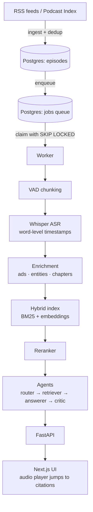

# Earshot

**Ask any podcast a question and hear the exact moment it was answered.**

Thousands of hours of expert conversation live in podcasts, and almost none of it is
searchable. Finding "that bit where someone explained X" means scrubbing through
three-hour episodes. Earshot transcribes podcast audio, indexes it, and answers
questions across many episodes at once. Every claim in an answer carries a
**timestamp citation**, and clicking it plays the original audio from that second.

> *"What do AI researchers say about scaling laws hitting a wall?"*
> → An answer drawn from several episodes, with each claim linked to the moment it was said.

**Status:** 🚧 In active development. Milestones 1, 2 and 4 are complete: ingestion,
a crash-safe job queue, transcription with word-level timestamps, and evaluated hybrid
search. Answering with citations is next. See [Roadmap](#roadmap).

---

## How it works



One kind of data flows through one straight pipeline: **audio → text → search → answer**.

| Stage | What happens | Why it's built this way |
|---|---|---|
| **1. Ingest** | Read a podcast's RSS feed and store each episode's metadata and audio URL. | Each episode gets a fingerprint (`sha256(feed + guid)`) with a UNIQUE constraint, so re-running ingestion never creates duplicates. |
| **2. Queue** | Every new episode gets a `transcribe` job in a Postgres table. | Workers claim jobs with `SELECT … FOR UPDATE SKIP LOCKED`: parallel workers never grab the same job, and no Redis is needed. Failures retry with exponential backoff. Jobs from crashed workers are reclaimed after a timeout, and a fencing token stops a slow worker from overwriting the new owner. |
| **3. Chunk** | Voice activity detection cuts audio at silences. | Chunks never split a word in half, which would corrupt transcripts at the boundaries. |
| **4. Transcribe** | Whisper turns speech into text with word-level timestamps; chunks are stitched back together. | Groq's Whisper API for speed, with local `faster-whisper` as a fallback when rate-limited. |
| **5. Enrich** | Detect sponsor segments, extract people/companies/papers, and generate chapters. | Zero-shot classification keeps ads out of answers without hand-labelled training data. |
| **6. Search** | Overlapping time-window chunks, indexed two ways, then reranked. | Keyword search (BM25) catches exact names; embeddings catch meaning. Hybrid beats either alone, and the reranker fixes the final order. |
| **7. Answer** | A router picks the strategy; an answerer writes with citations; a critic checks them. | The critic verifies every quote by **exact string match against the transcript**, not by asking another LLM, so a fabricated quote cannot get through. |
| **8. Serve** | FastAPI backend, Next.js frontend with an audio player. | Clicking a citation streams the publisher's own audio from that timestamp. |

### Design decisions

- **Postgres as the queue, not Redis.** One fewer moving part. Jobs are durable (they
  survive crashes), queryable, and claimed atomically. At this scale (hundreds of
  episodes), Postgres is more than enough.
- **Idempotency everywhere.** Ingesting the same feed twice, or enqueueing the same job
  twice, is a no-op, enforced by the database rather than by application code. The queue
  delivers at-least-once (a reclaimed job can run twice), so every stage is safe to repeat.
- **Fail fast.** Every network call has a timeout, and missing config stops the app at
  startup with a clear message instead of failing halfway through a job.
- **Stream, never rehost.** Podcasts are copyrighted. Earshot stores transcripts for search
  and plays audio from the publisher's original URL. The UI shows only short snippets.
- **Measured, not vibes.** Each stage has its own evaluation (below), and CI blocks
  deploys that make the metrics worse.

### How quality is measured

| Stage | Metric |
|---|---|
| Transcription | Word error rate (WER) on a LibriSpeech subset plus hand-corrected podcast audio |
| Ad detection | Precision / recall against hand-labelled segments |
| Retrieval | Recall@k, MRR, and **timestamp hit rate**: does the cited clip land within ±15 s of the true answer? |
| Answers | Faithfulness and citation accuracy on a golden Q&A set |

### Results so far

**Transcription:** 73 LibriSpeech utterances (`hf-internal-testing/librispeech_asr_dummy`,
1,169 words, ~9 min), joined with 1 s gaps and run through the full pipeline (VAD →
chunks → Groq). Scoring is "align by text, then measure time", so timestamp error
can't leak into WER. Measured 2026-10-05 ([raw results](evals/results/)).

| Model | WER | Correct words timestamped inside their true utterance | Worst offset |
|---|---|---|---|
| `whisper-large-v3` | 2.65% | 99.1% | 1.35 s |
| `whisper-large-v3-turbo` | 2.65% | 99.5% | 0.55 s |

The two models tie on clean read speech. On a real NPR episode they also agree on the
content, but `large-v3` **silently skipped a 68-word ad passage** that turbo kept. An
accidental omission could just as well drop real content, so **`whisper-large-v3-turbo` is the
default**: same accuracy, tighter timestamps, 2.8× cheaper on the paid tier. Ad removal is
an explicit step (enrichment), not luck. Timestamps are far inside the ±15 s that
citations need.

The podcast eval also exposed **anchoring bias**: a hand-corrected reference that started
from a model's draft kept 99.7% of the draft, so it measured agreement with that model, not
accuracy. The scorer now flags any reference that changed less than 1% of the draft.

**Retrieval:** 45 LLM-generated, deliberately paraphrased questions over 9 episodes (875
passages), each with an exact answer time located from a verbatim quote. Recall is a lower
bound (only one passage counts as correct per question). Measured 2026-10-06
([results](evals/results/retrieval.json)).

| Mode | Recall@1 | Recall@5 | MRR | p50 latency (laptop CPU) |
|---|---|---|---|---|
| Keyword (Postgres full-text) | 0.29 | 0.53 | 0.38 | 31 ms |
| Vector (bge-small + pgvector) | 0.58 | 0.80 | 0.67 | 41 ms |
| Hybrid (RRF) | 0.51 | 0.76 | 0.60 | 69 ms |
| **Hybrid + rerank (jina-reranker-v1-tiny, default)** | **0.80** | **0.93** | **0.85** | 1.35 s |
| Hybrid + rerank (MiniLM-L-12) | 0.82 | 0.93 | 0.86 | 2.9 s |

Reranking is the big win. Plain RRF *hurt* top-1 on paraphrased questions (the keyword
leg adds noise there), but it helps exact-term queries ("AGENTS.md") and keeps recall@10
high for the reranker. Passage *starts* are too coarse for citations (the answer sits
about 15 s in), so answers cite the exact quoted words instead.

```powershell
uv run earshot eval librispeech --model whisper-large-v3
```

---

## Roadmap

| Milestone | Scope | Status |
|---|---|---|
| **M0** Setup | uv project, tests, secrets hygiene | ✅ Done |
| **M1** Ingestion + queue | RSS ingestion, dedup, Postgres job queue (claim / retry / backoff / crash recovery) | ✅ Done |
| **M2** Speech pipeline | VAD chunking, Whisper, timestamp stitching, WER eval | ✅ Done |
| **M3** Enrichment | Ad detection, NER, chapters + summaries | Planned |
| **M4** Retrieval | Hybrid keyword + embeddings, reranker, retrieval evals | ✅ Done |
| **M5** Agents | Router, answerer with citations, deterministic critic | ⏳ Next |
| **M6** Live product | FastAPI on Render, Next.js on Vercel, rate limiting | Planned |
| **M7** LLMOps | Langfuse tracing, CI eval gate, cost per audio-hour, embedding versioning | Planned |

Stretch goals: speaker diarization ("who said it"), spoken answer briefings (TTS),
Urdu-language podcasts.

---

## Tech stack

| Area | Choice |
|---|---|
| Language / tooling | Python 3.12, [uv](https://docs.astral.sh/uv/), pytest |
| Database + queue + vectors | PostgreSQL 17 + pgvector (Docker locally), psycopg 3 |
| Ingestion | feedparser, httpx |
| Speech *(planned)* | Silero VAD, Whisper (Groq API / faster-whisper) |
| Search | Postgres full-text + `bge-small-en-v1.5` embeddings (fastembed/ONNX), RRF, jina-reranker-v1-tiny cross-encoder |
| Serving *(planned)* | FastAPI (Render), Next.js (Vercel) |
| Observability *(planned)* | Langfuse, CI eval gate |

---

## Getting started

**Prerequisites:** [uv](https://docs.astral.sh/uv/getting-started/installation/) and
[Docker Desktop](https://www.docker.com/products/docker-desktop/).

```powershell
git clone https://github.com/MoZainUlAbideen/Earshot.git
cd Earshot
uv sync                          # create .venv and install locked dependencies
Copy-Item .env.example .env      # then set a Postgres password (and API keys later)
docker compose up -d --wait      # start Postgres and wait until it's healthy
```

> On macOS/Linux use `cp .env.example .env`.

### Try it

```powershell
uv run earshot ingest https://feeds.npr.org/510318/podcast.xml --limit 1
uv run earshot worker --once
uv run earshot status
```

```
1 new episode(s) queued for transcription, 0 already known.
… INFO job 1: episode 1, attempt 1/3
… INFO job 1: done (4 chunks sent, 0 from checkpoints)
episodes: 1
jobs done: 1
```

A 35-minute episode becomes about 6,000 words with word-level timestamps in about a
minute. Run `ingest` again and it reports `0 new … 1 already known` (idempotency).
Use `earshot worker --until-empty` to process the whole queue and exit; an interrupted
job is handed back to the queue immediately.

Then index and search:

```powershell
uv run earshot index
uv run earshot search "What is an AGENTS.md file used for?"
```

```
1. [26:44] From AGENTS.md to Enterprise Deployment  (score 4.103)
   ...
```

Each hit is a ~45 s passage with the timestamp to cite. Search combines Postgres
full-text and pgvector embeddings (Reciprocal Rank Fusion), then a cross-encoder reranks.
Measure it with `uv run earshot eval retrieval`.

### Run the tests

```powershell
uv run pytest
```

Tests run against a separate `earshot_test` database (created automatically), so they
never touch your dev data. They include concurrency tests proving that parallel workers
claim every job exactly once. External APIs are mocked, so the default run needs no
network and spends no quota.

Contract tests against the real Groq API are skipped by default. They need
`GROQ_API_KEY` and use a few seconds of audio quota:

```powershell
uv run pytest -m live
```

---

## Project structure

```
src/earshot/
  cli.py          # `earshot ingest` / `earshot worker` / `earshot status`
  db.py           # connection (with timeout) and schema setup
  schema.sql      # episodes + jobs tables
  ingest.py       # RSS fetch → parse → dedup → save + enqueue
  queue.py        # enqueue / claim (SKIP LOCKED) / complete / fail / defer / reclaim_stale
  audio.py        # decode, Silero VAD, chunks cut in silences, FLAC encoding
  transcribe.py   # Groq Whisper client (word timestamps, error classification)
  pipeline.py     # checkpointed episode transcription (chunks table)
  download.py     # streamed temp download with timeout and size cap
  worker.py       # claim → download → transcribe → complete, failures routed
  passages.py     # transcript → overlapping 45 s windows
  index.py        # build passages for finished episodes
  embed.py        # bge-small embeddings, versioned per row
  search.py       # keyword + vector + RRF + rerank
  evals/          # WER (Whisper normalizer) + LibriSpeech eval, align-by-text scoring
tests/            # pytest suite + fixtures (sample RSS feed)
docs/             # project plan and decisions
evals/results/    # committed eval results (JSON)
docker-compose.yml  # local Postgres 17
LEARNINGS.md      # per-milestone log: what was built, what broke, how it was fixed
```

---

## Learning log

This project is built in public as a learning exercise in AI engineering and system design.
[LEARNINGS.md](LEARNINGS.md) records, for each milestone, what was built, what broke, and
how it was fixed: for example, a test suite that hung because `localhost` resolved to
IPv6 first.
